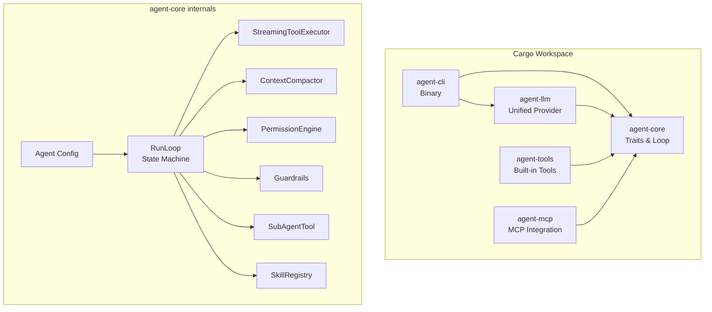
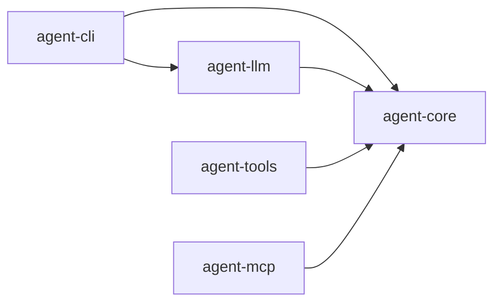
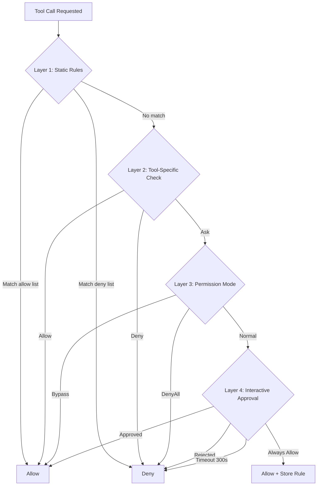

# Design Document: Rust Agent Framework

## Overview

This document describes the technical design for `arlo-rust`, a Rust-native autonomous agent framework implementing a streaming-first main loop inspired by Claude-Code's architecture combined with OpenAI Agents JS's composability patterns.

The framework is structured as a Cargo workspace with five crates providing clean separation of concerns: core traits and loop logic (`agent-core`), unified LLM provider abstraction (`agent-llm`), built-in tool implementations (`agent-tools`), MCP server integration (`agent-mcp`), and a CLI binary (`agent-cli`).

**Key design goals:**
- Zero-cost abstractions with no GC pauses during streaming
- Fearless concurrency via `tokio` async runtime with `Send + Sync` guarantees
- Explicit state machine (NextStep enum) for clarity in control flow
- Fully serializable state for pause/resume at any point
- Model-agnostic provider abstraction behind feature flags
- Streaming-first tool execution (tools start during model generation)

---

## Architecture



### Crate Dependency Graph



The workspace root `Cargo.toml` declares all five members. `agent-core` is the foundational library with zero dependencies on sibling crates, ensuring it compiles independently. All other crates depend on `agent-core` for shared traits and types.

---

## Components and Interfaces

### 1. Core Traits (`agent-core`)

#### ModelProvider and Model

```rust
#[async_trait]
pub trait ModelProvider: Send + Sync {
    async fn resolve(&self, model_name: &str) -> Result<Arc<dyn Model>, ModelError>;
    fn available_models(&self) -> Vec<&str>;
}

#[async_trait]
pub trait Model: Send + Sync {
    async fn stream(&self, request: ModelRequest) -> Result<ModelStream, ModelError>;
    async fn complete(&self, request: ModelRequest) -> Result<ModelResponse, ModelError>;
    fn name(&self) -> &str;
    fn provider(&self) -> &str;
    fn context_window(&self) -> usize;
    fn max_output_tokens(&self) -> usize;
    fn supports_tools(&self) -> bool;
    fn input_cost_per_million(&self) -> f64;
    fn output_cost_per_million(&self) -> f64;
}

pub type ModelStream = Pin<Box<dyn Stream<Item = Result<StreamChunk, ModelError>> + Send>>;
```

Both traits require `Send + Sync` bounds to support concurrent access from multiple tokio tasks. The `Model` trait provides a default `complete()` implementation that collects the stream.

#### Tool Trait

```rust
#[async_trait]
pub trait Tool: Send + Sync {
    fn name(&self) -> &str;
    fn description(&self) -> &str;
    fn parameters_schema(&self) -> serde_json::Value;
    fn concurrency(&self, input: &serde_json::Value) -> Concurrency;
    fn approval_requirement(&self) -> &ApprovalRequirement { &ApprovalRequirement::Never }
    async fn execute(&self, input: serde_json::Value, ctx: &ToolContext) -> Result<ToolOutput, ToolError>;
    fn timeout(&self) -> Option<Duration> { None }
    fn error_cascades(&self) -> bool { false }
    fn is_enabled(&self, ctx: &RunContext) -> bool { true }
}

#[derive(Debug, Clone, Copy, PartialEq, Eq)]
pub enum Concurrency {
    Safe,       // Can run in parallel with other Safe tools
    Exclusive,  // Must run alone
}
```

The `concurrency()` method accepts the tool input so classification can be dynamic (e.g., a shell tool could mark `ls` as Safe but `rm` as Exclusive).

### 2. NextStep State Machine

The loop's control flow is governed by a discriminated enum:

```rust
#[derive(Debug, Clone, PartialEq)]
pub enum NextStep {
    Continue { reason: ContinueReason },
    FinalOutput { text: String, structured: Option<serde_json::Value> },
    Interruption { pending: Vec<PendingApproval> },
    Recovery { strategy: RecoveryStrategy },
    BudgetContinue { remaining_turns: u32, reason: String },
    MaxTurns { count: u32 },
    Aborted { reason: String },
}
```

Each variant encodes exactly what the loop should do next. The `resolve_next_step()` function inspects the model response, tool results, and agent configuration to produce the appropriate variant.

### 3. RunState (Serializable Snapshot)

```rust
#[derive(Debug, Clone, Serialize, Deserialize, PartialEq)]
pub struct RunState {
    pub run_id: String,
    pub session_id: Option<String>,
    pub messages: Vec<Message>,
    pub current_turn: u32,
    pub max_turns: Option<u32>,
    pub total_cost_usd: f64,
    pub total_usage: Usage,
    pub pending_approvals: Vec<PendingApproval>,
    pub compaction_state: CompactionState,
    pub trace_id: String,
    pub schema_version: String,  // semver, e.g., "1.0.0"
}
```

RunState derives `Serialize`, `Deserialize`, and `PartialEq`. The `serialize()`/`deserialize()` methods use `serde_json` for byte-level persistence. Malformed input to `deserialize()` returns a typed `Err` without panicking.

### 4. Main Loop Architecture

The RunLoop is an async stream generator that yields `RunEvent`s:

```mermaid
stateDiagram-v2
    [*] --> ContextCompaction
    ContextCompaction --> PrepareRequest
    PrepareRequest --> StreamModel
    StreamModel --> DrainTools
    DrainTools --> ResolveNextStep
    ResolveNextStep --> Continue: NextStep::Continue
    ResolveNextStep --> FinalOutput: NextStep::FinalOutput
    ResolveNextStep --> Interruption: NextStep::Interruption
    ResolveNextStep --> Recovery: NextStep::Recovery
    ResolveNextStep --> MaxTurns: NextStep::MaxTurns
    ResolveNextStep --> Aborted: NextStep::Aborted
    Continue --> ContextCompaction
    Recovery --> ContextCompaction: Retry
    Recovery --> [*]: GiveUp
    FinalOutput --> [*]
    Interruption --> [*]
    MaxTurns --> [*]
    Aborted --> [*]
```

Each iteration executes six phases:
1. **Context Compaction** — Apply multi-stage compaction pipeline if thresholds exceeded
2. **Prepare Request** — Resolve instructions, tools, build ModelRequest
3. **Stream Model + Execute Tools** — Stream chunks, enqueue tools immediately on ToolUseEnd
4. **Drain Remaining Tools** — Await any tools still executing after stream ends
5. **Resolve NextStep** — Determine state transition from response + results
6. **Apply State Transition** — Match on NextStep, mutate state, continue or exit

### 5. StreamingToolExecutor

The key latency optimization: tools start executing during model streaming, before the stream completes.

```rust
pub struct StreamingToolExecutor {
    queue: Vec<TrackedTool>,
    completed: Vec<ToolExecutionResult>,
    executing_count: usize,
    max_concurrency: usize,  // default: 8, minimum: 1
    sibling_cancel: CancellationToken,
}
```

**Concurrency rules:**
- Safe tools run in parallel with other Safe tools (up to `max_concurrency`)
- Exclusive tools wait until all executing tools complete, then run alone
- While an Exclusive tool runs, no other tools start
- Results from `drain_completed()` are returned in enqueue order

**Error cascading:** When a tool with `error_cascades() == true` fails, the executor cancels all sibling executing tools via `CancellationToken`.

### 6. Context Compactor

Multi-stage pipeline for keeping message history within model context limits:

```rust
pub struct CompactionConfig {
    pub stages: Vec<CompactionStage>,
    pub summary_model: Option<String>,
}

pub enum CompactionStage {
    Snip { max_history_tokens: usize },
    TruncateToolResults { max_chars: usize },
    AutoSummarize { threshold_tokens: usize, preserve_recent: usize },
    Custom(Arc<dyn CompactionFn>),
}
```

Stages execute sequentially in defined order. Each stage checks its threshold and either modifies messages or passes through. The `Snip` stage always preserves system messages and the most recent user message. `AutoSummarize` requires a `summary_model` to be configured; otherwise it's skipped.

### 7. Permission Engine (4-Layer Pipeline)



The engine evaluates layers in strict order, short-circuiting at the first definitive decision. Session-scoped "always allow" rules accumulate during a run via `grant_session_allow()`.

### 8. Sub-Agent Isolation Model

Sub-agents are exposed to the parent model as tools (`SubAgentTool`). When invoked:
- A fresh `run_loop()` is spawned with empty message history
- The sub-agent has no access to the parent's conversation
- Token usage and cost are accumulated into the parent's `RunState`
- For `background: true`, the sub-agent runs as a detached tokio task

This is the Claude-Code isolation model (not handoffs), preventing context contamination.

### 9. Unified LLM Provider (`agent-llm`)

A single `UnifiedProvider` struct implements `ModelProvider` with backends behind feature flags:

```toml
[features]
default = ["openai", "anthropic"]
openai = ["dep:reqwest"]
anthropic = ["dep:reqwest"]
ollama = ["dep:reqwest"]
all-providers = ["openai", "anthropic", "ollama"]
```

**Rationale for unified crate vs. separate crates:**
- Shared retry/backoff logic (single implementation)
- One canonical message format with per-provider mappers
- Built-in multi-provider fallback chain
- Centralized cost calculation
- Single mock for all providers in tests

Model name routing: `"anthropic:claude-sonnet-4-20250514"` routes to Anthropic; unprefixed names route to the configured `default_provider`. `from_env()` auto-detects providers from environment variables.

### 10. Guardrail System

Three guardrail trait boundaries:

| Trait | Boundary | Timing |
|-------|----------|--------|
| `InputGuardrail` | Before first model call | First turn only |
| `OutputGuardrail` | After final output | Before delivery |
| `ToolGuardrail` | Before/after tool execution | Every tool call |

Guardrails execute sequentially in registration order, short-circuiting at the first `passed: false`. A failing `InputGuardrail` on the first turn terminates the run immediately with `GuardrailTripped`.

### 11. Skill System

Skills are reusable prompt templates loaded from `SKILL.md` files with YAML frontmatter:

```rust
pub enum SkillContext {
    Inline,                           // Inject into current conversation
    Fork { max_turns: Option<u32> },  // Spawn isolated sub-agent
}
```

The `SkillRegistry` loads from project-level (`.agent/skills/`) and user-level (`~/.agent/skills/`) directories. Project-level takes precedence on name conflicts. Template variables (`$ARGUMENTS`, `$1`, `$2`, `${SKILL_DIR}`) are substituted at invocation time.

### 12. Run Events and Streaming API

```rust
pub enum RunEvent {
    TurnStart { turn: u32, agent: String },
    StreamChunk(StreamChunk),
    ToolStart { id: String, name: String },
    ToolEnd { id: String, name: String, output: ToolOutput },
    SubAgentStart { agent: String, task: String },
    SubAgentEnd { agent: String, output: String },
    Compaction(CompactionEvent),
    StepResolved(NextStep),
    AgentEnd { agent: String, output: String },
    Interruption { pending: Vec<PendingApproval> },
    GuardrailTripped { name: String, reason: String },
    MaxTurns { count: u32 },
    Aborted { reason: String },
    Error(RunError),
}

pub type RunStream = Pin<Box<dyn Stream<Item = RunEvent> + Send>>;
```

**Stream guarantees:**
- Exactly one terminal event (AgentEnd, MaxTurns, Aborted, or Error) closes the stream
- ToolStart always precedes the corresponding ToolEnd for the same tool id
- TurnStart is emitted at the start of each turn (turn numbers start at 1)

---

## Data Models

### Core Message Types

```rust
#[derive(Debug, Clone, Serialize, Deserialize, PartialEq)]
pub enum Message {
    System { content: String },
    User { content: Vec<ContentBlock> },
    Assistant { content: Vec<ContentBlock>, usage: Option<Usage> },
    ToolResult { tool_use_id: String, content: String, is_error: bool },
}

#[derive(Debug, Clone, Serialize, Deserialize, PartialEq)]
pub enum ContentBlock {
    Text(String),
    Image { media_type: String, data: String, source_type: String },
    ToolUse(ToolUseBlock),
}

#[derive(Debug, Clone, Serialize, Deserialize, PartialEq)]
pub struct ToolUseBlock {
    pub id: String,
    pub name: String,
    pub input: serde_json::Value,
}

#[derive(Debug, Clone, Serialize, Deserialize, PartialEq, Default)]
pub struct Usage {
    pub input_tokens: u64,
    pub output_tokens: u64,
    pub cache_read_tokens: Option<u64>,
}
```

### StreamChunk (Canonical Streaming Type)

```rust
#[derive(Debug, Clone, Serialize, Deserialize, PartialEq)]
pub enum StreamChunk {
    TextDelta { text: String },
    ThinkingDelta { text: String },
    ToolUseStart { id: String, name: String },
    ToolUseInputDelta { id: String, delta: String },
    ToolUseEnd { id: String, input: serde_json::Value },
    MessageStop { stop_reason: StopReason, usage: Usage },
}

#[derive(Debug, Clone, Copy, PartialEq, Eq, Serialize, Deserialize)]
pub enum StopReason {
    EndTurn,
    ToolUse,
    MaxTokens,
    StopSequence,
    ContentFilter,
}
```

### Error Hierarchy

```rust
#[derive(Error, Debug)]
pub enum RunError {
    #[error("Model error: {0}")]
    Model(#[from] ModelError),
    #[error("Tool error: {0}")]
    Tool(#[from] ToolError),
    #[error("Max turns exceeded: {0}")]
    MaxTurns(u32),
    #[error("Budget exceeded: ${0:.4}")]
    BudgetExceeded(f64),
    #[error("Guardrail triggered: {0}")]
    Guardrail(String),
    #[error("Serialization error: {0}")]
    Serialization(String),
    #[error("MCP error: {0}")]
    MCP(String),
    #[error("Aborted: {0}")]
    Aborted(String),
    #[error("Recovery exhausted after {0} attempts")]
    RecoveryExhausted(u32),
}

#[derive(Error, Debug)]
pub enum ModelError {
    #[error("API error {status}: {body}")]
    Api { status: u16, body: String },
    #[error("Rate limited, retry after {retry_after_ms}ms")]
    RateLimited { retry_after_ms: u64 },
    #[error("Prompt too long: {tokens} tokens")]
    PromptTooLong { tokens: usize },
    #[error("Max output tokens reached")]
    MaxOutputTokens,
    #[error("Connection error: {0}")]
    Connection(String),
    #[error("Stream interrupted: {0}")]
    StreamInterrupted(String),
}

#[derive(Error, Debug)]
pub enum ToolError {
    #[error("Invalid input: {0}")]
    InvalidInput(String),
    #[error("Execution failed: {0}")]
    ExecutionFailed(String),
    #[error("Timeout")]
    Timeout,
    #[error("Not available: {0}")]
    NotAvailable(String),
}
```

All error types use `thiserror` for ergonomic `?` propagation. `From` conversions enable `ModelError` and `ToolError` to convert into `RunError` automatically.

### Recovery Strategies

```rust
#[derive(Debug, Clone, PartialEq)]
pub enum RecoveryStrategy {
    CompactAndRetry,
    EscalateOutputTokens { max: u32 },
    ContinueMessage { attempt: u32 },
    FallbackModel { model: String },
    GiveUp { error: String },
}
```

Recovery mapping: `PromptTooLong` → `CompactAndRetry`, `MaxOutputTokens` → `ContinueMessage`. After 3 failed recovery attempts for the same error variant, escalation to `GiveUp` is automatic.

### Retry Configuration

```rust
pub struct RetryConfig {
    pub max_retries: u32,           // default: 3
    pub initial_backoff_ms: u64,    // default: 1000
    pub max_backoff_ms: u64,        // default: 30000
    pub backoff_multiplier: f64,    // default: 2.0
    pub retryable_statuses: Vec<u16>, // default: [429, 500, 502, 503, 529]
}
```

Backoff formula: `delay = min(initial_backoff_ms × backoff_multiplier^(attempt-1), max_backoff_ms)` with random jitter of 0–25%.

---

## Correctness Properties

*A property is a characteristic or behavior that should hold true across all valid executions of a system — essentially, a formal statement about what the system should do. Properties serve as the bridge between human-readable specifications and machine-verifiable correctness guarantees.*

### Property 1: Core type serialization round-trip

*For any* valid `Message` or `StreamChunk` value, serializing to JSON and then deserializing from JSON shall produce a value equal to the original.

**Validates: Requirements 2.6, 3.9**

### Property 2: RunState serialization round-trip

*For any* valid `RunState` instance, calling `serialize()` followed by `deserialize()` on the resulting bytes shall produce a `RunState` that is equal to the original via the derived `PartialEq` implementation.

**Validates: Requirements 7.6**

### Property 3: RunState deserialization robustness

*For any* arbitrary byte slice (including random, malformed, or zero-length bytes), calling `RunState::deserialize()` shall return a `Result::Err` without panicking.

**Validates: Requirements 7.5**

### Property 4: Concurrency classification enforcement

*For any* sequence of tool enqueue operations, the `StreamingToolExecutor` shall guarantee: (a) Safe tools run in parallel with other Safe tools when below `max_concurrency`, and (b) no Exclusive tool ever executes concurrently with any other tool.

**Validates: Requirements 10.2, 10.3, 10.8**

### Property 5: Tool result ordering preservation

*For any* set of tools completing in arbitrary order, `drain_completed()` shall return results in the original enqueue order.

**Validates: Requirements 10.4**

### Property 6: Snip compaction preserves critical messages

*For any* message history exceeding `max_history_tokens`, after the Snip stage executes: all system-role messages are preserved, the most recent user message is preserved, and the resulting token count is within the limit.

**Validates: Requirements 11.4**

### Property 7: Tool result truncation

*For any* tool result string exceeding `max_chars`, after the `TruncateToolResults` stage the result shall have length ≤ `max_chars` and end with the suffix `"[truncated]"`.

**Validates: Requirements 11.5**

### Property 8: AutoSummarize preserves system and recent messages

*For any* message history exceeding `threshold_tokens` when a summary model is configured, after `AutoSummarize` executes: all system-role messages are preserved, the `preserve_recent` most recent messages are preserved unchanged, and the remaining messages are replaced by a summary.

**Validates: Requirements 11.6**

### Property 9: Compaction no-op below thresholds

*For any* message history where no compaction stage's activation threshold is met, the compactor shall return `None` and the message history shall remain unchanged.

**Validates: Requirements 11.9**

### Property 10: Permission engine static rules short-circuit

*For any* tool call where the tool name matches a static allow rule, the `PermissionEngine` shall return `Allow` without evaluating Layers 2–4. *For any* tool call matching a static deny rule, it shall return `Deny` without evaluating further layers. In Bypass mode, all calls reaching Layer 3 return `Allow`. In DenyAll mode, all calls reaching Layer 3 return `Deny`.

**Validates: Requirements 12.3, 12.4, 12.5, 12.6, 12.7**

### Property 11: Guardrail execution semantics

*For any* sequence of registered guardrails, they shall execute sequentially in registration order, short-circuiting at the first that returns `passed: false`. Input guardrails shall only be invoked on the first turn and never on subsequent turns.

**Validates: Requirements 13.5, 13.8, 13.9**

### Property 12: Sub-agent isolation

*For any* sub-agent invocation regardless of parent state, the sub-agent's RunLoop shall start with empty message history and shall not have access to the parent's messages.

**Validates: Requirements 14.3, 14.6**

### Property 13: Sub-agent cost accumulation

*For any* sub-agent run that produces token usage and cost, those values shall be added to the parent `RunState`'s `total_usage` and `total_cost_usd` fields.

**Validates: Requirements 14.7**

### Property 14: Model name routing

*For any* model name string containing a recognized provider prefix (e.g., `"anthropic:..."`, `"openai:..."`), the `UnifiedProvider` shall route to the specified provider. *For any* unprefixed model name, it shall route to the configured `default_provider`.

**Validates: Requirements 16.4, 16.5**

### Property 15: Message format conversion round-trip

*For any* valid canonical `Message` value, converting to a provider-specific wire format and back shall preserve all content, role assignments, and tool-call structures.

**Validates: Requirements 16.7**

### Property 16: RunError Display includes context

*For any* `RunError` variant constructed with specific field values, the `Display` output shall contain those variant-specific context values (e.g., status codes, tool names, turn counts).

**Validates: Requirements 17.5**

### Property 17: Recovery escalation

*For any* `ModelError` variant, if recovery is attempted more than 3 times for the same variant within a single run, the RunLoop shall escalate to `GiveUp`.

**Validates: Requirements 18.6**

### Property 18: Skill template variable substitution

*For any* skill body containing template variables (`$ARGUMENTS`, `$1`, `$2`, `${SKILL_DIR}`) and any argument string, the `SkillTool` shall substitute all recognized variables correctly and leave unresolved positional variables as empty strings.

**Validates: Requirements 20.7**

### Property 19: Event stream well-formedness

*For any* run execution (regardless of outcome), the RunLoop shall emit exactly one terminal event (AgentEnd, MaxTurns, Aborted, or Error) as the final event. Additionally, for every tool execution, ToolStart shall always be emitted before the corresponding ToolEnd for the same tool id.

**Validates: Requirements 21.8, 21.9**

### Property 20: Temperature validation

*For any* floating-point value outside the range [0.0, 2.0], the `RunConfig` builder shall reject the temperature configuration.

**Validates: Requirements 22.3**

### Property 21: Exponential backoff formula

*For any* attempt count `n` (1 through `max_retries`), the computed backoff delay shall equal `min(initial_backoff_ms × backoff_multiplier^(n-1), max_backoff_ms)` plus random jitter of 0–25%.

**Validates: Requirements 25.2**

### Property 22: Usage and cost accumulation

*For any* sequence of turns each producing a `Usage` value, the `RunState.total_usage` shall equal the component-wise sum of all individual usage values. The `total_cost_usd` shall equal `Σ (input_tokens × input_rate + output_tokens × output_rate) / 1_000_000` across all turns.

**Validates: Requirements 26.2, 26.3**

### Property 23: Budget enforcement

*For any* configured budget value, when `total_cost_usd` exceeds the budget after a turn completes, the RunLoop shall resolve `NextStep::Aborted` with reason `"budget_exceeded"` before starting the next turn.

**Validates: Requirements 26.4**

### Property 24: Skill registry precedence

*For any* skill name that exists in both project-level and user-level directories, the `SkillRegistry.find()` method shall return the project-level skill.

**Validates: Requirements 20.4**

---

## Error Handling

### Error Classification and Recovery

| Error | Recovery Strategy | Max Retries |
|-------|-------------------|-------------|
| `ModelError::PromptTooLong` | `CompactAndRetry` | 3 |
| `ModelError::MaxOutputTokens` | `ContinueMessage` | 3 |
| `ModelError::RateLimited` | Backoff + retry in `agent-llm` | 3 |
| `ModelError::Api { status: 5xx }` | Retry with backoff | 3 |
| `ModelError::Connection` | Retry with backoff | 3 |
| `ModelError::StreamInterrupted` | `ContinueMessage` | 3 |
| `ToolError::Timeout` | Return error to model | - |
| `ToolError::ExecutionFailed` | Return error to model | - |

After 3 recovery attempts for the same error variant within a run, the system escalates to `GiveUp`, yielding an Error event and terminating.

### Error Propagation

- `ModelError` and `ToolError` convert to `RunError` via `From` implementations
- Tool errors are non-fatal by default — error text is returned to the model as a `ToolResult { is_error: true }`
- Only unrecoverable errors (GiveUp, guardrail trips, budget exceeded) terminate the loop
- The `?` operator propagates errors ergonomically through the async call stack

### Panic Safety

- `RunState::deserialize()` handles arbitrary input without panicking
- All `unwrap()` calls are restricted to provably-safe cases (e.g., after an `is_some()` check)
- Tool execution is wrapped in `tokio::spawn` with catch-unwind semantics

---

## Testing Strategy

### Unit Tests

Unit tests verify specific examples, edge cases, and integration points:
- Type construction and derive behavior (Serialize, Debug, Clone, PartialEq)
- Builder pattern defaults and validation
- Individual compaction stage behavior with concrete inputs
- Permission engine layer evaluation with specific rule configurations
- Guardrail short-circuit on specific failure scenarios
- Recovery strategy selection for each error type
- CLI argument parsing

### Property-Based Tests

Property tests verify universal correctness properties across randomized inputs using the `proptest` crate. Each property test runs a minimum of 100 iterations.

**Configuration:**
- Library: `proptest` (Rust's standard PBT library)
- Minimum iterations: 100 per property
- Tag format in comments: `// Feature: rust-agent-framework, Property {N}: {title}`

**Key property test areas:**
1. Serialization round-trips for all core types (Message, StreamChunk, RunState)
2. Concurrency enforcement in StreamingToolExecutor
3. Compaction invariants (preservation rules, threshold behavior)
4. Permission engine determinism and short-circuit guarantees
5. Event stream well-formedness invariants
6. Cost/usage accumulation correctness
7. Template variable substitution completeness

### Integration Tests

Integration tests verify cross-crate behavior and external interactions:
- Full RunLoop execution with mock ModelProvider
- MCP client connection lifecycle
- CLI binary execution with mock environment
- Multi-crate compilation under various feature flag combinations

### Test Organization

```
crates/
├── agent-core/src/
│   └── tests/              # Unit tests (inline #[cfg(test)] modules)
├── agent-llm/src/
│   └── testing/            # Mock provider, VCR recorder
├── agent-tools/src/
│   └── tests/
└── tests/                  # Workspace-level integration tests
    ├── roundtrip_tests.rs
    ├── executor_props.rs
    ├── compaction_props.rs
    └── permission_props.rs
```
