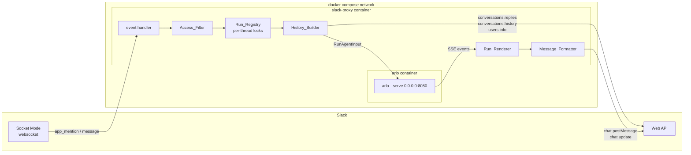
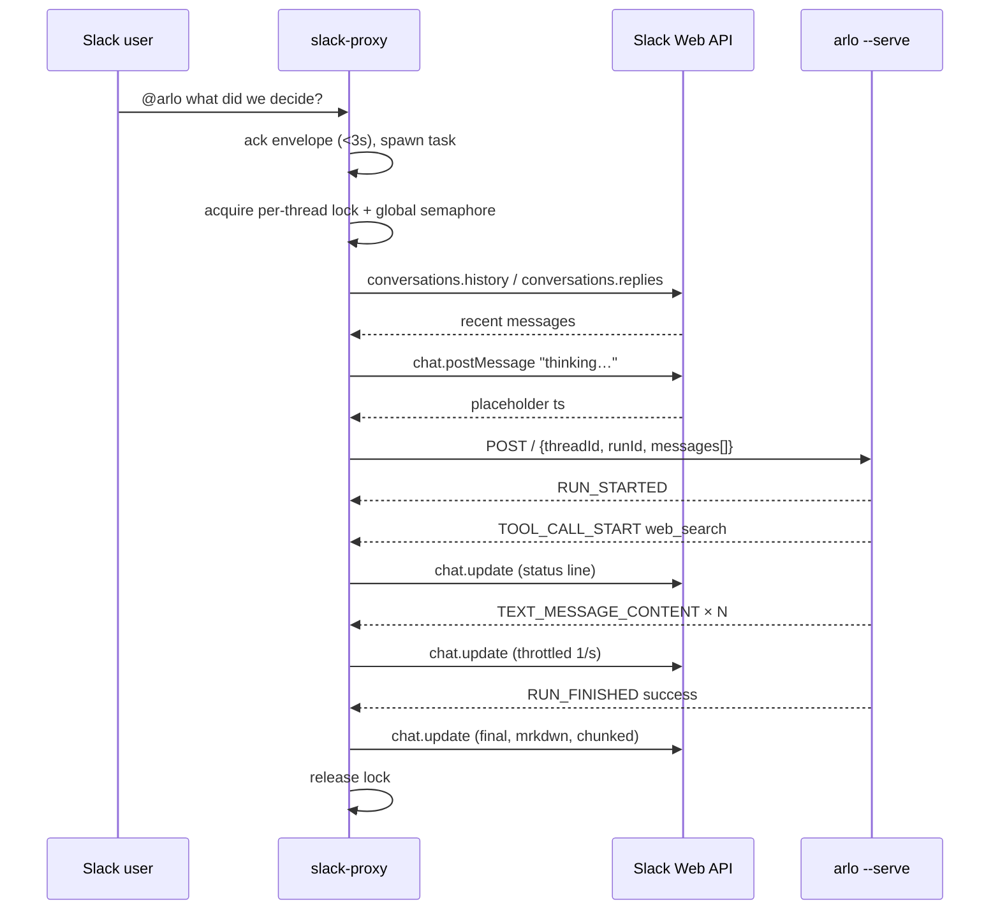
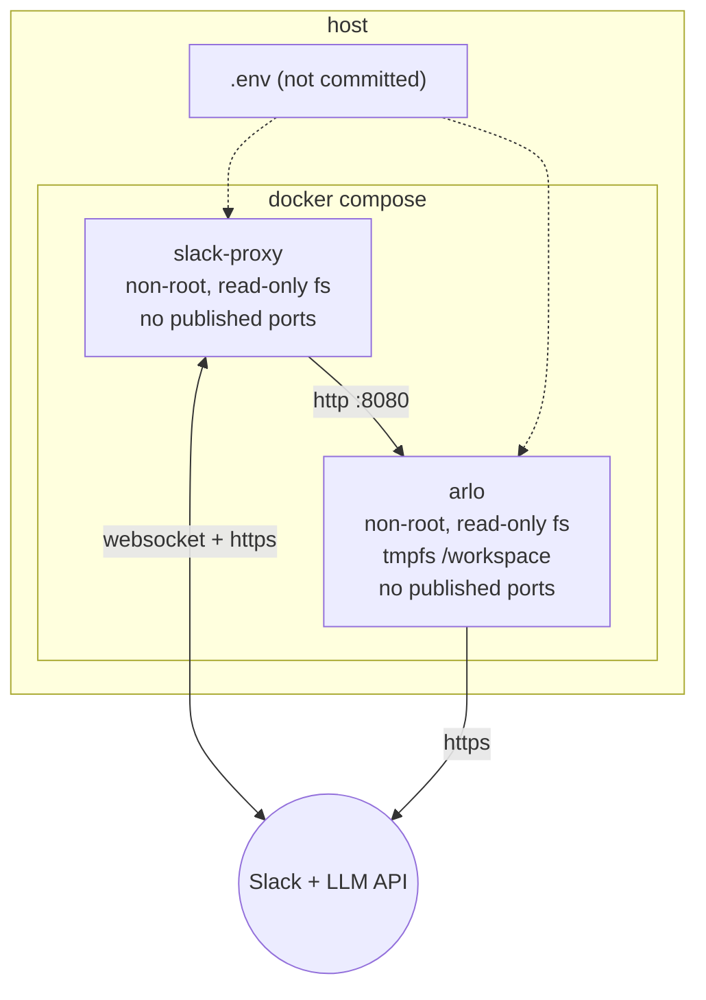

# Design Document: Slack Integration

## Overview

A Python service (`slack-proxy`) bridges Slack to a stateless `arlo --serve`
instance. It holds a Slack Socket Mode websocket inbound and speaks AG-UI over
HTTP/SSE outbound.

Two facts about Arlo drive the whole design:

1. **Arlo owns no conversation state.** `ArloBridge::convert_messages`
   (`crates/agent-cli/src/serve/bridge.rs`) rebuilds the prompt from the
   `messages` array on every request. The `SessionStore` keyed by `thread_id`
   exists only to park an interrupted run and is removed on completion. So the
   client must replay the transcript every turn.
2. **Arlo's serve mode runs tools unattended.** `crates/agent-cli/src/assembly.rs`
   maps `Surface::Serve` to `PermissionMode::Bypass` with a
   `DenyAllApprovalHandler`. There is no approval gate to hook into.

Fact 1 has a pleasant consequence: since we must supply history anyway, and
Slack already stores it, **Slack is the store**. No database, no volume, no
cache-invalidation. It falls out of the same `conversations.replies` call that
implements "read chat history when mentioned".

Fact 2 has an unpleasant one: access to the bot is access to unattended tool
execution. v1 answers this by containment (disposable container, no host mounts)
rather than by gating, which is only defensible because the bot's purpose is Q&A
on a scratch workspace. See [Security posture](#security-posture).

## Architecture



Only `slack-proxy` reaches the internet. `arlo` publishes no host port.

## Turn lifecycle



## Components

All components live in one Python package. Fewest files that stay readable:

```
integration/slack/
├── requirements.md
├── design.md
├── README.md              # setup: Slack app manifest, scopes, compose up
├── pyproject.toml
├── .env.example
├── Dockerfile
├── docker-compose.yml
├── src/arlo_slack/
│   ├── __init__.py
│   ├── app.py             # Bolt wiring, event handlers, Access_Filter
│   ├── history.py         # History_Builder
│   ├── arlo.py            # AG-UI client: POST + SSE iteration
│   ├── render.py          # Run_Renderer: SSE → throttled Slack edits
│   └── mrkdwn.py          # Message_Formatter: Markdown → mrkdwn, chunking
└── tests/
    ├── test_mrkdwn.py
    ├── test_history.py
    └── test_render.py
```

### `app.py` — wiring and filtering

Registers three Bolt handlers: `app_mention`, `message` (DM), `message`
(channel, threaded). Each handler acks immediately, applies the Access_Filter,
then hands off to an asyncio task so the 3-second Socket Mode budget is never
tied to run duration.

```python
def thread_key(event: dict) -> str:
    return f"{event['channel']}:{event.get('thread_ts') or event['ts']}"
```

Ignore rules, applied in order: bot-authored (`bot_id` present or
`user == bot_user_id`), non-plain subtype, already-seen `(channel, event_ts)`,
channel/user not in allowlist, untriggered non-thread message.

**Thread follow-up detection.** A threaded message in a joined channel is only
ours if the bot has posted in that thread. With no local state, that is answered
by the same `conversations.replies` call the History_Builder already needs — so
detection is free: fetch the thread, check for a bot-authored message, bail out
if there is none.

```python
# ponytail: one conversations.replies call per threaded message in any joined
# channel. Fine for a single workspace (Tier 3, 50+ req/min). If that becomes
# the bottleneck, add an LRU set of active thread_ts and only fall through to
# the API on a miss.
```

**Concurrency.** `Run_Registry` is a `defaultdict(asyncio.Lock)` keyed by
Thread_Key, plus one `asyncio.Semaphore(MAX_CONCURRENT_RUNS)` globally. A task
that finds the lock held adds ⏳, awaits, removes ⏳, and proceeds — which gives
FIFO ordering per thread and queue-not-reject globally for free. Entries are
dropped from the registry when the lock is released and uncontended.

### `history.py` — History_Builder

Produces the AG-UI `messages` array. Slack is read, never written to, here.

| Situation | Slack call | Included |
|---|---|---|
| Reply inside an existing thread | `conversations.replies` | up to `THREAD_HISTORY_LIMIT` (100) most recent replies |
| Top-level mention in a channel | `conversations.history` | up to `CHANNEL_HISTORY_LIMIT` (20) most recent messages, then the mention |
| DM | `conversations.replies` (thread) or `conversations.history` | as above |

Role mapping mirrors what `convert_messages` accepts — it keeps `User`,
`Assistant`, `System`, `Developer` and drops everything else, so only those are
worth sending:

- bot-authored → `assistant`
- everyone else → `user`, prefixed `"{display_name}: "` so the model can tell
  speakers apart in a multi-party thread
- a leading `system` message giving channel name, the fact that output renders
  in Slack, and a brevity instruction

Display names come from `users.info` behind a plain `dict` cache. The bot's own
`<@Uxxxx>` token is stripped from the triggering text.

Trimming is oldest-first until the total fits `HISTORY_CHAR_BUDGET` (12000), with
the triggering message pinned. A char budget rather than a token count: it is
one line, has no tokenizer dependency, and Arlo's own compaction pipeline handles
the real context-window bound downstream.

### `arlo.py` — AG-UI client

```python
async def run(messages: list[dict], thread_id: str) -> AsyncIterator[dict]:
    body = {
        "threadId": thread_id,
        "runId": str(uuid.uuid4()),
        "messages": messages,
        "state": None,
        "tools": [],          # Arlo ignores client tools; uses its own
        "context": [],
        "forwardedProps": {},
    }
    async with aconnect_sse(client, "POST", ARLO_URL, json=body) as es:
        async for sse in es.aiter_sse():
            yield json.loads(sse.data)
```

camelCase is required — `RunAgentInput` derives
`#[serde(rename_all = "camelCase")]`. The whole call is wrapped in
`asyncio.timeout(RUN_TIMEOUT_SECONDS)`.

### `render.py` — Run_Renderer

Consumes the event stream, maintains one Slack message. Event handling:

| AG-UI event | Action |
|---|---|
| `RUN_STARTED` | no-op (placeholder was posted before the request) |
| `TEXT_MESSAGE_START` | no-op |
| `TEXT_MESSAGE_CONTENT` | append `delta` to the buffer, request a throttled flush |
| `TEXT_MESSAGE_END` | request a flush |
| `TOOL_CALL_START` | set status line `_running {name}…_`, flush |
| `TOOL_CALL_ARGS` | ignore |
| `TOOL_CALL_END` | clear status line |
| `STEP_STARTED` | ignore — emitted per thinking-delta and per turn, no user value |
| `RUN_FINISHED` (success) | final flush without status line |
| `RUN_FINISHED` (interrupt) | report unsupported-approval error; do not resume |
| `RUN_ERROR` matching `RUN_FINISHED with active steps` | treat as success — see [Upstream defect](#upstream-defect-serve-mode-never-emits-run_finished) |
| `RUN_ERROR` (any other) | replace with the error, preserving partial text |
| stream ends with no terminal event | report interrupted stream, preserve partial text |

Throttling is a monotonic-clock check, not a timer task: flush if
`now - last_flush >= UPDATE_INTERVAL_SECONDS`, always flush on terminal events.
On HTTP 429, sleep `Retry-After` and retry — the buffer is the source of truth,
so nothing is lost.

The status line is rendered *below* the accumulated text so the answer does not
jump around as tools come and go.

### `mrkdwn.py` — Message_Formatter

Two independent, pure, easily-tested functions.

**`to_mrkdwn(text) -> str`.** Splits on fenced code blocks first, converts only
the non-code segments, rejoins. Conversions: `**b**`/`__b__` → `*b*`,
`*i*`/`_i_` → `_i_`, `[t](u)` → `<u|t>`, `^#{1,6} h` → `*h*`.
Order matters — bold before italic, or `**x**` degrades to `_*x*_`.

**`chunk(text, limit) -> list[str]`.** Splits at `MAX_MESSAGE_CHARS` (3800,
under Slack's 4000 with headroom for the status line), preferring `\n\n`, then
`\n`, never mid-word. Tracks fence state: if a chunk boundary lands inside a
fence, append ` ``` ` to close it and prepend ` ```{lang} ` to the next.

Only the last chunk is edited while streaming; earlier chunks are posted once.

## Data model

The AG-UI request the proxy builds:

```json
{
  "threadId": "C0123ABCD:1712345678.000100",
  "runId": "7f3a...-uuid",
  "messages": [
    {"id": "s0", "role": "system",    "content": "You are replying in the Slack channel #eng…"},
    {"id": "m1", "role": "user",      "content": "alice: we're deciding between SSE and websockets"},
    {"id": "m2", "role": "assistant", "content": "Earlier I suggested SSE."},
    {"id": "m3", "role": "user",      "content": "bob: what did we decide?"}
  ],
  "state": null,
  "tools": [],
  "context": [],
  "forwardedProps": {}
}
```

There is no proxy-side schema, no table, no file. Everything above is derived
from a Slack API response on each turn and discarded.

## Deployment



The Arlo image builds from a multi-stage `Dockerfile` at the **repository root**,
not under `integration/slack/` — containerizing `arlo` is a repo-level concern
that a future Discord or Teams integration will reuse. Compose references it with
`context: ../..`. First build compiles the Rust workspace; expect minutes.

Compose sketch:

```yaml
services:
  arlo:
    build: { context: ../.., dockerfile: Dockerfile }
    command: ["arlo", "--model", "${ARLO_MODEL}", "--serve", "0.0.0.0:8080"]
    environment: [OPENAI_API_KEY, OPENAI_BASE_URL, ANTHROPIC_API_KEY, BRAVE_API_KEY]
    read_only: true
    tmpfs: [/workspace, /tmp]
    user: "10001:10001"
    mem_limit: 2g
    pids_limit: 256
  slack-proxy:
    build: { context: ., dockerfile: Dockerfile }
    depends_on: [arlo]
    environment: [SLACK_BOT_TOKEN, SLACK_APP_TOKEN, ARLO_URL, ...]
    read_only: true
    user: "10001:10001"
```

### Configuration

| Variable | Default | Purpose |
|---|---|---|
| `SLACK_BOT_TOKEN` | — | `xoxb-…`, required |
| `SLACK_APP_TOKEN` | — | `xapp-…` app-level token for Socket Mode, required |
| `ARLO_URL` | `http://arlo:8080/` | AG-UI endpoint |
| `ARLO_MODEL` | — | passed to `arlo --model`; fixed per container |
| `CHANNEL_HISTORY_LIMIT` | `20` | messages read on a top-level mention |
| `THREAD_HISTORY_LIMIT` | `100` | thread replies read per turn |
| `HISTORY_CHAR_BUDGET` | `12000` | trim threshold, oldest-first |
| `RUN_TIMEOUT_SECONDS` | `300` | abandon the SSE stream past this |
| `MAX_CONCURRENT_RUNS` | `4` | global semaphore |
| `UPDATE_INTERVAL_SECONDS` | `1.0` | `chat.update` throttle |
| `MAX_MESSAGE_CHARS` | `3800` | chunk size |
| `SLACK_ALLOWED_CHANNELS` | *(empty = all)* | comma-separated channel ids |
| `SLACK_ALLOWED_USERS` | *(empty = all)* | comma-separated user ids |
| `SHUTDOWN_GRACE_SECONDS` | `30` | drain window on SIGTERM |
| `LOG_LEVEL` | `INFO` | |

### Slack app configuration

Bot token scopes: `app_mentions:read`, `chat:write`, `channels:history`,
`groups:history`, `im:history`, `reactions:write`, `users:read`.
App-level token scope: `connections:write`.
Event subscriptions: `app_mention`, `message.im`, `message.channels`,
`message.groups`.

`channels:history` is the scope an admin will question — it is required because
thread follow-ups arrive as ordinary `message.channels` events. The proxy
discards everything that is not a threaded message in a thread it participates
in, but the *scope* is workspace-visible regardless. The alternative is
requiring an @-mention on every turn (Requirement 2 alternative, rejected).

The README ships a Slack app manifest so scopes and subscriptions are not
hand-configured.

## Upstream defect: serve mode never emits `RUN_FINISHED`

**Verified by running it**, not by reading it. A Python `httpx` + `httpx-sse`
client against `./target/debug/arlo --serve 127.0.0.1:8099` (pointed at a fake
OpenAI-compatible streaming server, no real credentials) produced:

```
HTTP 200 text/event-stream
  <- RUN_STARTED
  <- STEP_STARTED   {'stepName': 'turn-1'}
  <- TEXT_MESSAGE_START
  <- TEXT_MESSAGE_CONTENT × 6
  <- TEXT_MESSAGE_END
  <- RUN_ERROR      {'message': 'RUN_FINISHED with active steps: {"turn-1"}'}
```

The connection, the camelCase request body, the role-tagged messages, and the
text streaming are all correct — the assembled answer came back intact. But the
run terminates in `RUN_ERROR` on **every** successful run.

Cause: `EventMapper` in `crates/agent-cli/src/serve/bridge.rs` emits
`StepStarted { step_name: "turn-N" }` on `RunEvent::TurnStart` and never emits a
matching `StepFinished`. `ag-ui-server`'s `EventVerifier` (`verify.rs:71`)
rejects a `RUN_FINISHED` while any step is still open, and converts it to
`RUN_ERROR`. The library tests this exact rule itself
(`verify.rs::finish_with_open_step_fails`).

A second instance of the same bug is latent: `StreamChunk::ThinkingDelta` maps
to `StepStarted { step_name: "thinking" }` on *every* delta, so the second
thinking delta trips `STEP_STARTED: step 'thinking' already active`. The
Anthropic provider emits `ThinkingDelta` (`anthropic_http.rs:786`), so any
Anthropic model with extended thinking fails mid-stream, not just at the end.

**Fix in Arlo (preferred).** Small, and it fixes every AG-UI client, not just
Slack: emit `StepFinished` for `turn-N` at the start of the next `TurnStart` and
before every terminal event, and drop the `"thinking"` `StepStarted` (it is
already ignored by this design — use the proper `THINKING_START`/`THINKING_END`
pair if reasoning ever needs surfacing).

**Tolerate in the proxy (also do this).** The proxy should treat a `RUN_ERROR`
whose message starts with `RUN_FINISHED with active steps` as a successful
completion, so it works against an unpatched Arlo. Cheap, and it keeps the
integration decoupled from the Rust release.

```python
# ponytail: workaround for the unclosed-step bug in bridge.rs's EventMapper.
# Delete once Arlo emits StepFinished — the RUN_FINISHED branch then covers it.
if ev["type"] == "RUN_ERROR" and ev["message"].startswith("RUN_FINISHED with active steps"):
    return finish_successfully()
```

## Security posture

State this plainly in the README, not just here:

- Serve mode executes tools **without approval**. Anyone who can mention the bot
  can cause shell commands, file writes, and web fetches to run inside the
  `arlo` container.
- The mitigation is containment, not authorization: disposable container, no
  host mounts, no Docker socket, non-root, read-only rootfs, tmpfs workspace,
  memory and pid limits.
- Prompt injection is live. Channel history is untrusted input, and the agent
  has a web-fetch tool. Assume anything the bot can read can be exfiltrated by a
  crafted message. Do not invite the bot to channels containing secrets.
- `SLACK_ALLOWED_CHANNELS` is the kill switch when an unexpected invite happens.
- Tokens come from the environment. Nothing is logged: no message text, no tool
  arguments, no token values.

If the bot's purpose ever changes — a host mount, MCP servers, real
infrastructure access — this posture is invalid and HITL becomes a prerequisite,
which requires the Rust changes noted in Out of Scope.

## Error handling

| Failure | Behaviour |
|---|---|
| Missing/invalid tokens at startup | log, exit non-zero |
| Websocket drop | Bolt reconnects with backoff; log at `warning` |
| Arlo unreachable | report in thread, log at `error` |
| `RUN_ERROR` "RUN_FINISHED with active steps" | treat as success (upstream defect workaround) |
| `RUN_ERROR` (other) | replace placeholder, keep partial text |
| Run exceeds timeout | abandon stream, report timeout in thread |
| Stream ends without terminal event | report interrupted stream, keep partial text |
| `RUN_FINISHED` outcome `interrupt` | report unsupported; signals `PermissionMode` misconfiguration |
| Slack history call fails | proceed with the triggering message only, log degradation |
| `chat.update` 429 | honour `Retry-After`, retry; buffer is source of truth |
| Unhandled exception in a handler | log traceback, generic failure in thread, keep serving |

## Testing strategy

Unit tests, no live Slack and no live Arlo:

- **`mrkdwn.py`** — the only place with real algorithmic risk, so it gets the
  most coverage. Bold-before-italic ordering; code fences untouched; links;
  headings. Chunking: never exceeds the limit, never splits mid-word, rejoined
  chunks equal the input modulo inserted fences, fence-crossing splits reopen
  with the same language tag.
- **`history.py`** — role mapping, bot-vs-user classification, mention
  stripping, name prefixing, oldest-first trimming pins the trigger message,
  API failure degrades to trigger-only. Fed canned Slack API payloads.
- **`render.py`** — driven by a canned list of AG-UI events: throttle emits at
  most one update per interval, terminal events always flush, `RUN_ERROR`
  preserves partial text, missing terminal event is reported, `STEP_STARTED` is
  ignored.

One end-to-end smoke check against a live `arlo --serve` on localhost,
documented in the README as a manual step rather than automated — mocking a
whole SSE agent run costs more than it catches.
